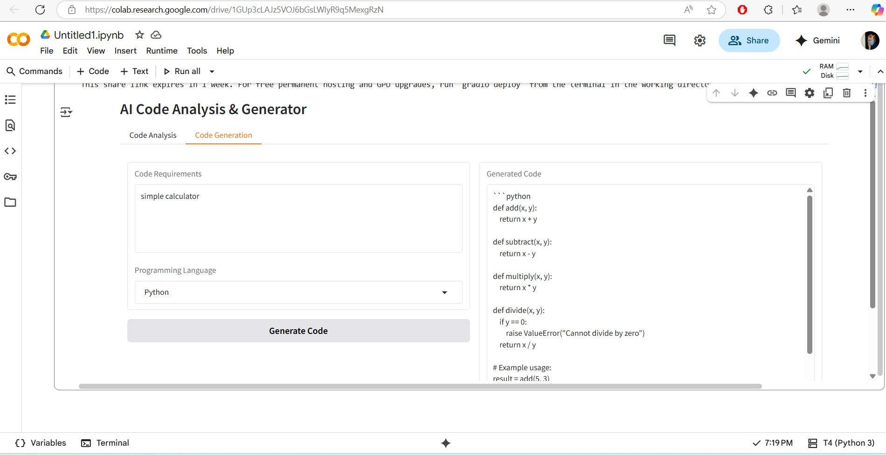

# SDLC-IBM-PROJECT
Project Overview
SmartSDLC is an AI-driven approach to enhance the traditional Software Development Life Cycle by automating requirement analysis, health monitoring, and improving efficiency.

🚀 Features
Requirement Analyzer (AI-based)
Health Monitoring AI
Automated suggestions for SDLC phases
Easy integration with UI
🛠 Tech Stack
Python
Flask / Django (if applicable)
Machine Learning (scikit-learn, TensorFlow, etc.)
HTML/CSS/JS (for UI)
📂 Project Structure
Phase-1: Problem statement, requirement analysis, literature survey
Phase-2: Core coding (requirement analyzer, health AI, ML models)
Phase-3: UI + Integration

TEAM LEADER
Karthikeyan S

TEAM MEMBERS
Pranesh SP
Siddharth MC
Sanjay S

## SDLC Output

